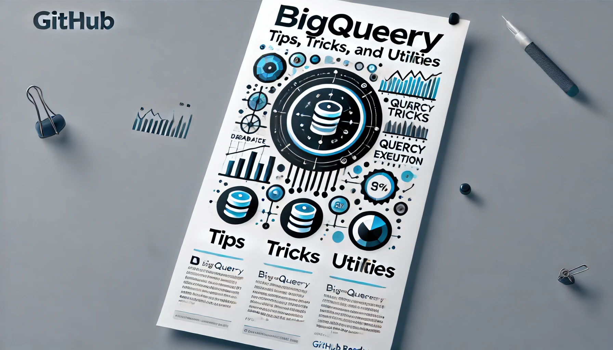

# BigQuery Tips, Tricks and Utilities

  <i align="center">A compilation of various BigQuery Tips, Tricks and Utilities I have discovered and used over the years. </i>

  

## 🧠 Project Introduction

 

🚀  Your feedback is greatly appreciated. 

 

## 🔧 How to Setup/ Run

 

##  📚 Helpful Links

  

## 🌏 External Services Used

 

## 📝  To Do

 
 

    

<h4 align="center">
  <a href="https://www.beardeddata.com/"> BeardedData.com </a>

